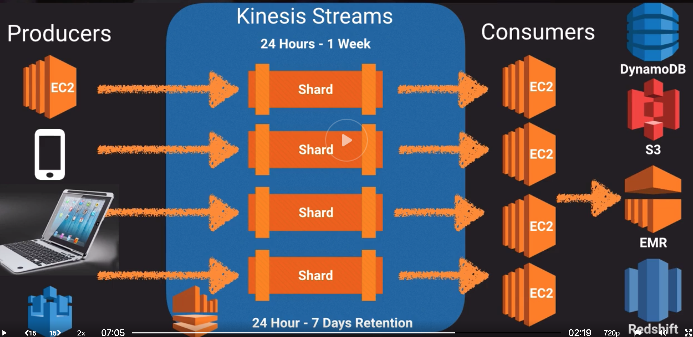
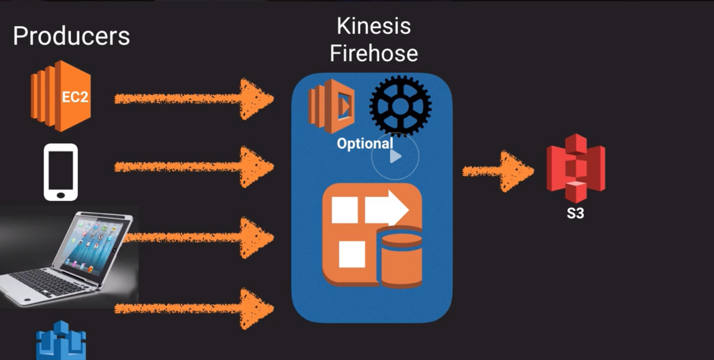
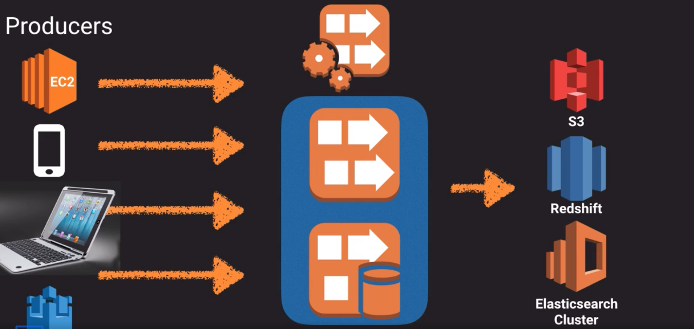

# SQS

First ever AWS service.

Message queue.

EC2 instances can poll the queue for work. Auto scaling groups can be scaled based on the queue size.

**Pull based** system (workers poll the queue).

Used for decoupling components in a distributed application. Acts as a buffer.

Messages can contain up to **256KB** of text in any format.

1 min to 14 days in queue.

Visibility timeout (30 sec to 12 h): when a reader picks up a  mesage, the message becomes invisible in the queue. If the message is processed before the Visibility timeout expires, the message is deleted from the queue. If not processed, the message becomes visible again for another reader to process. This could result in same message delivered twice.

**Long polling**: polls take longer for less polling (cheaper). Only return response if message in queue or timeout reached.

## Standard queues

No order guaranteed. Messages delivered at least once.

## FIFO queues

First in first out. Order strictly preserved. No duplicates in the queue.
300 transaction per second.

Messages delivered only once.

# SWF

Simple WorkFlow service

Actors:

* Workflow starter
* Decider: Controls the coordination of tasks
* Worker: Get, process, update task (can be ec2, person, etc)

Good if task requires human interaction.
Timeframe up to 1 year.

A task is assigned once. Never duplicated.
Task oriented API (as opposed to message oriented in SQS)

# SNS
Simple notification service

Send notification from the cloud. PubSub paradigm. Push notifications (no poll required) (as opposed to SQS which pulls notifications).

Simple API, no maintenance or management overhead. Pay as you go.

Can deliver to mobile devices (apple, google, windows, etc), SMS, email, HTTP endpoint and SQS.

Messages are stored redundantly across multiple AZs.

**Topics**: Access point for recipients to subscribe.

$0.50/million requests
$0.06 per 100,000 notification deliveries over HTTP
$0.75 per 100 sms
$2.00 per 100,000 emails

# Elastic Transcoder

Convert media files in the cloud.

Pay per minute and resolution transcoded.

# API Gateway

Publish, maintain, monitor and secure APIs.

"Front door" fora applications to access data from back-end services (e.g. EC2, Lambda,etc)

API Caching. Responses for calls stay cached for TTL in case they are made again.

CloudWatch to log. Throttling available.

Same origin policy.

CORS (cross origin resource sharing) can be enabled in API gateway.

Scales automatically.

# Kinesis

Streaming data generated continuously by thousands of data sources that send data records simultaneously, small in size (Kb) e.g. purchases from store, stock prices, game data, social network data, geospatial data.

## Kinesis streams
Producers (devices, sensors, etc) --> Kinesis streams (24h to 7 days) in "shards" --> Comsumers (e.g. EC2) --> storage

## Kinesis firehose
Producers --> Kinsesis firehose --> storage

Firehose does not hold the data, it is processed right away.

## Kinesis analytics
Allows SQL queries to both Kinesis streams and firehose. Sits above them.

# SES

Simple Email Service
