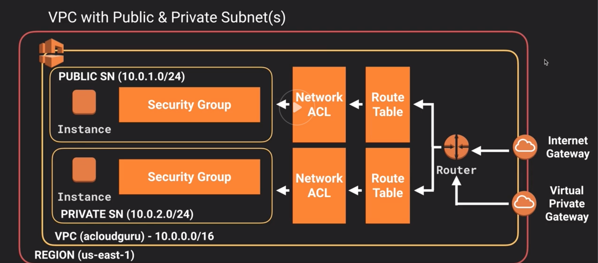

# VPC

Virtual data center in the cloud. Logically isolated section of AWS.

Control of the virtual networking environment:
* IP address range
* Creation of subnets
* Config of route tables and network gateways

Public facing subnets, private subnets, NACLS.

VPN connection between org physical data center and AWS cloud.
 "Customer Gateway" and "Virtual Private Gateway".

Launch instances into chosen subnet
Assign custom IP ranges in each subnet
Configure route tables between subnets
Only one internet gateway per VPC
Security groups can span multiple VPCs
Subnet ACLs
5 VPC max per account

VPC peering - connect two vpcs via private route. Within same or different aws account. No transitive peering.

1 subnet = 1 AZ

Security groups are stateful
NACLs are stateless.

Subnets have to be created. Route tables, Security groups and NACLs are created by default when creating a new VPC.

When provisioning a VPC, the IP count depends on the CIDR block chosen. 5 IP addresses are always lost for the network address, router, broadcast.

In a custom VPC with new subnets in each AZ, there is a Route that supports communication across all subnets/AZs. Plus a Default SG with an allow rule 'All traffic, All protocols, All ports, from anything using this Default SG'.

## VPC
10.0.0.0/16

ACL, Route table and security group are automatically created when creating a VPC.

## Subnet
10.0.1.0/24
'No' auto assign public IP addresses by default.

## Internet gateway
Detached by default. Only one allowed per VPC.

Provided by default in a default VPC, but not in a manually created VPC

"Egress-Only Internet Gateway" is to allow IPv6 based traffic within a VPC to access the Internet, whilst denying any Internet based resources the possibility of initiating a connection back into the VPC.

## Route tables
Set `0.0.0.0/0` and `::/0` to target the gateway for the VPC.

## EC2 Instances
When creating an instance, place in VPC and subnet.
Instances in private subnet have no access to internet.

In Amazon VPC, an instance retains its private IP after a reboot

## NAT instances
Network Address Translation
EC2 instance. Acts as a port to the internet.
Disable source or destination check (NAT instance uses traffic that is not sourced or destined to it).
Must be in public subnet.
There must be a route out of the private subnet to the NAT instance.
Can be used as a bastion also.

Instance size matters for bandwidth.
Behind SG.

## NAT gateways
Use public subnet. 0.0.0.0/0 to NAT gateway.
Automatically managed and scaled up to 10Gbps
No need to patch. No sec groups.
Remember to update route tables.

## NACLs

Network Access control list.

VPC comes with NACL by default. It allows all traffic.

One subnet can only be assigned to one NACL.

One NACL can have multiple subnets.

NACLs cannot span VPCs. One VPC per NACL.

Stateless (unlike security groups). Outbound and inbound conditions are independent.

IP addresses can be blocked with NACLs but not with SGs.

Rules are evaluated in order. Rule numbers should be initially incremented by 100 to leave room to add new rules in between existing rules.

## Custom VPC and ELBs
Load balancers need to be in at least 2 subnets. They need to be internet facing.

## VPC Flow logs

* VPC level
* subnet level
* network interface level

Logs network traffic to cloudwatch.

Some traffic cannot be monitored (windows licenses, amazon dns server, etc)

## VPC endpoints

Create IAM role and attach to EC2 instance.

Create endpoint (Elastic Network Interface). These allow access to AWS services from private subnet via private network (as opposed to via internet through NAT instance or gateway)

## Cleaning up
Delete EC2 instances
Detach and delete Internet gateway
Delete NAT gateways/instances
Delete VPC
